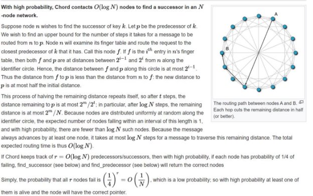

# Chord-Algorithm-Implementation
Implemented CHORD file system with eclipse attack

**Assignment 7        Security Forensics Lab**

**Implement CHORD Routing Protocol And perform Eclipse Attack**

**-By Kushagra Khare -Roll No. : 20CS02004**

**Question:**

1. **Implement and simulate the CHORD algorithm of file sharing.**

**How to run ?**

-Run the command g++ Chord.cpp

-Then enter the input in the following manner:

Enter m value

Enter the number of queries

Enter the queries on each different line

**Functionalities offered by the code:**

**AddNode Node\_id**

- Adds new node in the system with id equal to Node\_id

**AddKey Key\_id Value**

- Adds a new key in the system.

**Show Node\_id**

- Shows the finger table/ successor table for the corresponding Node\_id.

**Stabilize**

- Runs stabilization function for the entire system.

**Search Key\_id**

- Searches the key and returns the node at which the key is present.
- The search algorithm implemented is as follows:
- First go to the first node and search for the value greater than or equal to the key value.
- If not found then move to the furthest dst\_node and repeat the process.

**Sample Input:**

5

20 AddNode 3 AddKey 21 AddKey 31 Search 31 AddKey 6 AddNode 22 Show 3 AddNode 31 AddNode 17 Search 6 Show 16 Show 17 AddKey 20 AddKey 11 AddKey 18 Search 31 AddKey 15 AddNode 16 Show 31 Search 18

**Sample Output:** Successfully Added Node: 3 Successfully Added Key: 21 Successfully Added Key: 31 Key is present at Node: 3 Successfully Added Key: 6 Successfully Added Node: 22

Finger Table for node: 3 (i)(id+2^i)(Dst\_Node)

0 4 22

1 5 22

2 7 22

3 11 22

4 19 22

Keys Present at this node: 31

Successfully Added Node: 31 Successfully Added Node: 17 Key is present at Node: 17 No node found

Finger Table for node: 17

(i)(id+2^i)(Dst\_Node)

0 18 22

1 19 22

2 21 22

3 25 31

4 1 3

Keys Present at this node: 6

Successfully Added Key: 20 Successfully Added Key: 11 Successfully Added Key: 18 Key is present at Node: 31 Successfully Added Key: 15 Successfully Added Node: 16

Finger Table for node: 31 (i)(id+2^i)(Dst\_Node)

0 0 3

1 1 3

2 3 3

3 7 16

4 15 16

Keys Present at this node: 31

Key is present at Node: 22

**Complexity Analysis:**

**Security Issues of Chord Protocol:**

Some of the security issues in the Chord protocol include:![ref1]

**Sybil Attacks:** Chord is vulnerable to Sybil attacks, where an attacker creates multiple malicious nodes to control a significant portion of the network. This can disrupt the correct functioning of the protocol and lead to data inconsistency.

**Eclipse Attacks**: In an eclipse attack, an attacker surrounds a target node with malicious nodes in the Chord ring, preventing the target from discovering honest nodes. This can lead to routing errors and data compromise.

**Routing Table Poisoning:** An attacker may join the Chord network and provide false information in its routing table, causing the network to route messages through the attacker, leading to data interception or manipulation.

**Malicious Nodes:** Chord assumes that nodes are cooperative and honest, but malicious nodes can behave arbitrarily, refusing to store data, dropping messages, or providing false information, compromising the integrity and availability of data.

**Man-in-the-Middle Attacks**: Chord messages are typically sent in plaintext, making it susceptible to man-in-the-middle attacks where an attacker intercepts and modifies messages between nodes.

**Secure Key Management:** Chord relies on consistent hashing to map keys to nodes. Ensuring secure key management and key distribution can be challenging, especially in a dynamic network where nodes join and leave.

**Denial of Service (DoS) Attacks:** Chord nodes are resource-constrained, and an attacker can overwhelm a node with a flood of requests, causing a denial of service for legitimate users.

**Churn Management:** Chord assumes that nodes are stable and do not frequently join or leave the network. In real-world scenarios, nodes may frequently enter and exit the network, making it challenging to maintain data consistency and availability.

**Trust and Authentication:** Chord does not have built-in mechanisms for node authentication or trust establishment, leaving the network vulnerable to impersonation and unauthorized access.

To mitigate these security issues in Chord and similar DHT protocols, various countermeasures and security enhancements can be implemented. These may include cryptographic techniques for securing communication, robust node admission and eviction policies, reputation systems to identify malicious nodes, and protocols for handling churn in a secure manner. Additionally, combining Chord with other security mechanisms or using it as part of a larger secure infrastructure can enhance its overall security posture.

**Question:**

2. **Simulate an eclipse attack on the third server which will be joining the network for the CHORD file**

**sharing network.**

*Note: Eclipse attack is an attack where the intruder creates false nodes around the network to manipulate the affected node.*

**Added another functionality:**

**-> EclipseAttackOn (node):**

Specify on which node the attack has to take place.

**Sample Input**:

5

17

AddNode 3 AddKey 21 AddKey 31

Search 31

AddKey 6 AddNode 22

Show 3

AddNode 31 AddNode 17

Show 31 EclipseAttackOn 31 Show 16

Show 17

Search 31 AddNode 16 Search 6

Show 31

**Output:**

Successfully Added Node: 3 Successfully Added Key: 21 Successfully Added Key: 31 Key is present at Node: 3 Successfully Added Key: 6 Successfully Added Node: 22

Finger Table for node: 3 (i)(id+2^i)(Dst\_Node)

0 4 22

1 5 22

2 7 22

3 11 22

4 19 22

Keys Present at this node: 31

Successfully Added Node: 31 Successfully Added Node: 17

Finger Table for node: 31 (i)(id+2^i)(Dst\_Node)

0 0 3

1 1 3

2 3 3

3 7 17

4 15 17

Keys Present at this node: 31

After attack:

Finger Table for node: 31 (i)(id+2^i)(Dst\_Node)

0 0 0

1 1 1

2 3 3

3 7 7

4 15 15

Keys Present at this node: 31

Malicious Nodes are: 0 1 7 15

No node found

Finger Table for node: 17 (i)(id+2^i)(Dst\_Node)

0 18 22

1 19 22

2 21 22

3 25 31

4 1 1

Keys Present at this node:

Key is present at Node: 31

Successfully Added Node: 16 Key is present at Node: 7

Finger Table for node: 31 (i)(id+2^i)(Dst\_Node)

0 0 0

1 1 1

2 3 3

3 7 7

4 15 15

Keys Present at this node: 31

**How does the attack work ?**

Basically the victim node’s finger table is intercepted and all the nodes which are present as dst\_nodes are connected to malicious nodes.

**The End**
